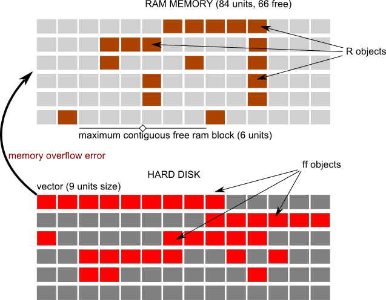
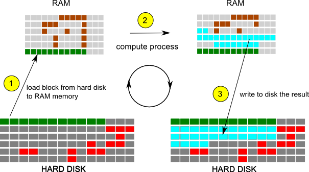
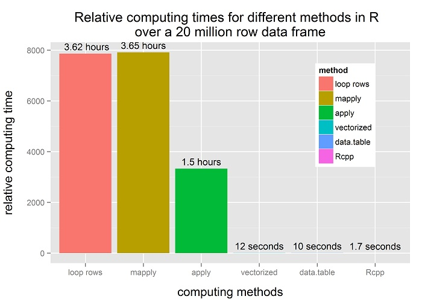
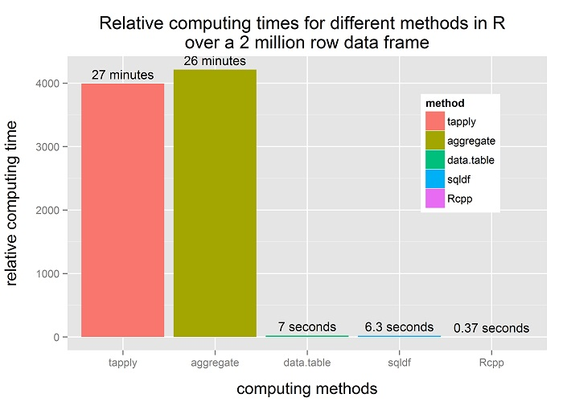

## Why R ??

> **R** is dynamic, to say the least. 
> More precisely, it is organic, with new functionality and add-on packages appearing constantly. 
> And because of its open-source nature and free availability, 
> R is quickly becoming the software of choice for statistical analysis in a variety of fields.

[A Handbook of Statistical Analysis Using R][handbook]

[handbook]: http://cran.r-project.org/web/packages/HSAUR/vignettes/Ch_introduction_to_R.pdf  "R intro"


---
## Why R? 

> 1. OPEN SOURCE 
>2. it is used in an increasing number of research centers and media. 
>3. with some patience, you can do almost ANYTHING with your data. 
>4. is similar to other high performance languages, like C++ , python, etc. 
>5. it is cross platform and can be extremely efficient. 
>6. integration with other languages (C++, etc.).
>7. large amount of specific packages-
>8. great graphics capabilities.
>9. very dynamic users community
>10. **it is the FUTURE...** 

---
## SAS VS R 

SAS | R
--------- |----------
Payed |free
Medium performance  | Variable performance 
No memory issues | Possible memory issues  
Stable workflow  | Custom workflow 
Difficult to expand  | Expandable, full amount of packages
Poor graphics  | Great graphics
Fixed documentation | Disperse, but very active community 
*Recommended to:* | *Recommended to:*
Linear, non-programmers | non-linear, custom and graphics 

--- 
## MOTIVATION 

**The "approach":** 

* Science as an open and accessible social development. 
* World-wide sharing and support
* Freedom to customize 


---
## MOTIVATION 2 

**R** is an open source programming language that is widely used in statistical computations. 
More and more researchers and Universities are using R as the main statistical analysis language. 

**R** is one of the best options to use in statistical analysis.

BUT, 

**R** faces many problems while using Large Data Sets. 
And that can make R a non-convenient language for large data analysis. 

Solving this problems will take R to other dimension : 

### EFFICIENT LARGE DATA ANALYSIS 

--- #memory1

## THE MEMORY PROBLEM 

**R** is using RAM memory to store computed, computing and temporal data. 
RAM overflow errors are common when we use large data in R.

There is not only the limitation of the RAM capacity, but also the limitation of contiguous free RAM blocks: To be able to store a vector in R, we need a contiguous free space in RAM memory for that vector.

And sometimes, while having still some hundreds of megabytes of free memory, we do not have any *contiguous free block* bigger that a few megabytes. 

Then, any large vector will not be able to fit into memory and we will get an error.

--- 

 

---

## MEMORY R EXAMPLE 

```{r,tidy=F, message=F}
pr <- function(x){object.size(x) }
xint <- 0L; 
N <- 1e6
x <- rep(23L,N); m.int <- pr(x)
x <- rep(0.23,N); m.float <- pr(x)
x <- as.Date("2000-01-01") + 1:N; 
m.date <-   pr(x)
x <- as.factor(1:N); m.factor <-  pr(x)
x <- as.factor(rep(23L,N)); m.factor.2 <- pr(x) #  it depends on the content !!!
x <- as.character(1:N); m.char <- pr(x)  
x <- as.character(rep(23L,N)); m.char2 <- pr(x) # it depends on the content !!!!
memos <- c(m.int,m.float,m.date,m.char,m.factor)
md <- data.frame(class = c("integer","numeric", "date","character", "factor"), size = round(memos/1e6,digits =1) )
```

---
## MEMORY R EXAMPLE (2)

So we have this sizes in Mb for vectors of 1 million item:
```{r} 
md
```

---
## MEMORY R EXAMPLE (3)

The problem arises when we try to load a vector of large size 
#### (2e8 integer, which will be 20*3.8=762 Mb) : 

```{r eval = F } 
N <- 2e8; x <- rep(0L,N); print(object.size(x), units="Mb")
gc()
```

Getting the error: 

    Error: cannot allocate vector of size 762.9 Mb


We are unable to load a 762 Mb vector, having 4 Gb of RAM , because we do not have a contiguous free memory block. 
We need a way to store efficiently data and temporal computation data into the hard drive, and load dinamically... 

---
## THE SPEED PROBLEM 

Dealing with large data needs efficient code to speed up computations. 
Non efficient code can result in extremely slow processes,  that can last hours or days instead of seconds or minutes. 

Special care must be done to produce efficient code, using native R code or some packages and/or other languages.


---
## SOLVING ISSUES : MEMORY 


To solve memory problems we need to write data into disk, instead of loading into RAM memory. 

The package `ff` and `ffbase` allow to do this and still do very efficient code. 

Some main functions of ffbase were **modified or re-coded** to allow more efficiency or avoid memory problems, 
that still exist using the ffbase package. 

Some internal coding of the package was modified by the authors after we had some useful discussions with them. 

The result is that to solve memory problems we use ffbase + some new functions, that avoid almost all the possible memory problems in R, while still keeping efficient code. 

## FFBASE + CUSTOM FUNCTIONS -->  NO MEMORY ERRORS 

---

## SOLVING ISSUES : SPEED

Large data --> speeds factors of 10 , 100 , 1000 or more between efficient and non-efficient code.
To accomplish a speed-optimized code, we have used 3 main procedures : 

> 1. **Efficient R code**. 
    Using vectorized functions, efficient built-in functions, etc. 
    This will make the code several orders of magnitude faster than other codes (see details in the tutorial files) 

> 2. **Use data.table** package for "group by" and split analysis. 
   data.table is a very efficient package that allows to compute "group by", splits, etc., 
   analysis in a very efficient way. 
   We use it   for almost any "group by" analysis and for other specific tasks. 

> 3. **Rcpp**:
   C++ code in R. 
   C++ is one of the fastest languages that we can code in computers. The package "Rcpp" and "inline" , 
   allow to create C++ code in R in    an "easy" way. 
   For some tasks, Rcpp code is thousands times faster than R code. We have developed some Rcpp functions to work with large data. 
   We have also made some tutorials about how, when, and why use Rcpp into R code.

--- &vcenter bg:#EDE0CF
##

## ffbase + efficient R +  data.table +  
## Rcpp + custom functions 
##  = 
## SPEED-OPTIMIZED CODE 


---

## SOLVING THE PROBLEM : THE INTERNAL PROCESS 

#### All those speed-efficient techniques are combined with ffbase to compute tasks into blocks that can fit into RAM memory, write the result in disk, and proceed with the next block of data loaded into RAM.  In this way, we obtain the benefits of speed,  avoiding memory problems. ####



--- bg:#EDE0CF

## CHOOSING A COMPUTER TO RUN R 

Due to this memory problem in R, a good computer to work with R would be one with a good RAM memory, working in 64bits OS and having fast write/read hard disk capabilities. 

The ideal computer would be : 

1. >= 16 GB RAM 
2. SD (solid state) hard disk
3. 64 bits Linux OS // 64bits Mac OSX  
4. Fast cpu, etc.

#### The work we present here is done while working in a **Windows 32bits computer with 4gb RAM**,  which is almost the "worst" computer we can get nowadays to work with R. 
#### Having this computer, we could work in a very efficient way with databases containing dozens of millions records and a few dozens of columns. 

Using the proposed techniques and functions, **any computer will be able to deal with large data in R**. 

And this opens a new possibility for the use of R with large data, for example for *less rich countries or for the common desktop computers*. 

---
## LARGE DATA EXAMPLE 

We compute the same task following different methods and finding their computational duration. 

1. Task 1: 
   in a large database, label records whith  
   date_min <= date < date_max and diagnose == "a" or "b" or "c" as "positive" and others as "negative". 

2. Task 2: 
   In a large database, for each ident, find the number of cases with diagnoses "d" , "e" or "f". 
  If n == 0 label case as "none", if 0< n <= 10 label = few , others: label = many. 


---

## The database:

The data (20 million rows) :: 

    df[1:3,]
    ident        date  diagnose region
    324958  1991-07-25       l    070
    1339198 1974-03-24       z    065
    553078  1978-01-06       s    065

Structure of the Data :: 

    str(df[1,])
    'data.frame':  1 obs. of  4 variables:
    $ ident   : Factor w/ 1999919 levels "1000","1001",..: 323942
    $ date    : Date, format: "1991-07-25"
    $ diagnose: Factor w/ 26 levels "a","b","c","d",..: 12
    $ region  : Factor w/ 18 levels "000","013","014",..: 15

---
## TASK 1 

Label records whith  date.min <= date < date.max and diagnose == "a" or "b" or "c" as "positive" and others as "negative"

* A. loop over the rows of the database. 
* B. mapply 
* C. vectorized function
* D. data.table
* E. Rcpp

---

## Speed comparison data : 


method  |  time | time.relative |time.20e6 |  label
--------- |---------- |---------- |---------- |----------
loop rows | 65.2800   |       7865   |   13056.00  |3.62 hours
mapply | 65.7000 |         7916  |    13140.00 |  3.65 hours
apply | 27.6400  |        3330  |     5528.00 |  1.5 hours
vectorized  | 0.0600   |          7   |      12.00 | 12 seconds
data.table  | 0.0500   |          6   |      10.00 | 10 seconds
Rcpp | 0.0083    |         1   |       1.66  | 1.7 seconds


---

## Graph the results :: 

```{r}
plot <- ggplot( speed,aes(x=method, y = time_relative,fill = method ,group= 1 )   ) 
plot <- plot +
         geom_bar(stat="identity") + 
         xlab('computing methods')  +  
         ylab('relative computing time')+ 
         ggtitle("Relative computing times for different methods in R  \n over a 20 million row data frame ") 

plot2 <- plot + 
      geom_text(data=speed,aes(x=method,y=time_relative,label= time_20e6),vjust=-0.5, size = 4)  + 
      theme( 
         plot.title=element_text(size=16, vjust = 1) 
         ,legend.position=c(0.82,0.67) 
         ,axis.title.x  = element_text(vjust=-1, size = rel(1.2))
         ,axis.title.y  = element_text(angle=90, vjust=0, size = rel(1.2))
         ,plot.margin=unit(c(1, 1, 1, 1), "lines")
        )


```
---
## Speed results 




---
## TASK 2  

In a large database, for each ident, find the number of cases with diagnoses "d" , "e" or "f". 

If n == 0 label case as "none", if 0< n <= 6 label = few , others: label = many. 

As a general rule, timings for group_by computations will depend on the number of levels for the variable grouped.

For same number of levels, the fact that data is ordered or not is not very important for some methods. 

For other methods, the ordering can improve the speed (as for ffdfdply for example).

---

## Speed comparison data : 
(2 million rows)

method |  time.relative | label 2e6 | label 20e6
--------- |---------- |----------  |----------
tapply |   3992 |  27 minutes  | 4.1 hours
aggregate  |  4212 |  26 minutes | 4.3 hours
data.table |  20  |  7 seconds | 1.24 minutes
sqldf   |   17 | 6.3 seconds | 1.05 minutes
Rcpp  |  1 | 0.37 seconds | 3.7 seconds


---
## Speed results 



--- 
## DOCUMENTATION : REPIDEMIOLOGY WEBSITE 

[http://repidemiology.wordpress.com/](http://repidemiology.wordpress.com/) , contains tutorials, videos and code about R. 
It is meant to be a site where beginners and advanced can learn and work with large data. 


---
## SOLVING THE PROBLEM : NEW FUNCTIONS 
## ( SUMMARY LIST)

* order_ffdf (data=,order_cols=,splits=,verbose=)
* subset_ffdf (data=,condition_cols=,condition=,splits=,verbose=)
* cbind_ffdf (x=,y=)
* append__ffdf (x=,y_=,chunk_s=)
* merge_by (x=,y=,keycols=,split_name=,chk=)
* index_ffdf (x=,idx=,verbose=)
* index_ffdf_split (x=,idx=,nsplits=,verbose=)
* split__apply_cpp (input_data=,split_vector=,chk_size_=,fu=)

---

## SOME NEW UTILITIES 
   
* redir_ffdf (ffdf=,newdir= ) 
* redir_ffdf_ffdfsave (ff=,newdir=)   
* is_ordered_by_row_col (data=,col_name=) 
* quote_names()     
* qn()                                
* lagpad (x=)
* asDate (x=)
* txt.perc (x=,dec=)
* fill.vec (x=,fill="*")
* fill.vec.all.same (x=,fill="*") 
* fill.data.frame (x=,fill.char="*",make.factors=FALSE)
* fill.data.frame.all.same (df,"_")  

---
## APPENDIX  

This documents was made using ONLY R. 
WIth packages `shiny` and `slidify`

This is an example of the code used : 

    >1. OPEN SOURCE 
    >2. it is used in an increasing number of research centers and media. 
    >3. with some patience, you can do almost ANYTHING with your data. 
    >4. is similar to other high performance languages, like C++ , python, etc. 
    
    
    
    
    
    ```{r,tidy=F, message=F}
     pr <- function(x){object.size(x) }
    xint <- 0L;
    ```
    

---
## APPENDIX 2 : INTERACTIVITY 

Counts of diagnoses = a,b,c for different regions. 
```{r echo = F, results = 'asis'}
require(rCharts)
n1 <- nPlot(Freq ~ diagnoseklasse, group = 'screening_region2007', type = 'multiBarChart',
            data = subset(screen, diagnoseklasse %in% c("a","b","c","X","d"))
)

n1$print('chart1')

```

    


